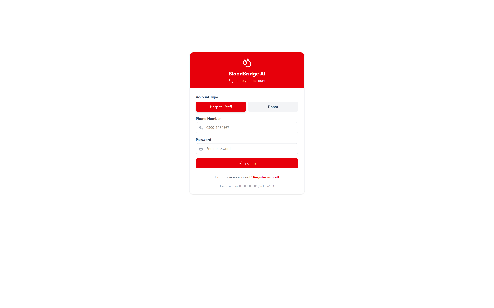

# BloodBridge AI — Emergency Blood Coordination System

BloodBridge AI coordinates emergency blood requests between hospitals, blood banks, and voluntary donors across Pakistan. It combines **verified access control**, **safe donor matching**, **health screening**, **data-driven demand forecasting**, and an **assistant chatbot** in a single dashboard.

**Live deployment:** https://bloodbridge-ai-two.vercel.app
**Demo admin:** phone `03000000001` · password `admin123`

## Problem

In a blood emergency, families in Pakistan waste critical hours calling relatives, posting on Facebook, and visiting blood banks one by one. Meanwhile:

- Blood banks can't anticipate demand, so rare groups run out without warning.
- Donors are contacted even when they are medically ineligible to donate again.
- Unverified requests circulate publicly with patient names and donor phone numbers attached — privacy is traded away in the panic.

## What it does

| Feature | How it works |
|---|---|
| **Verified Access Control** | Two JWT-authenticated account types (bcrypt-hashed passwords): **Hospital/Blood-Bank Staff** and **Donors**. Staff register with their institution + license number and start *pending*; a verified admin approves or rejects them in the Verification Panel. Only approved staff can post requests. |
| **Health Screening** | Every donor answers an 8-question pre-screening at signup (fever, HIV, hepatitis, chronic conditions, medication, recent procedures, pregnancy, malaria travel). Answers become safety flags visible to staff only — never to other donors. |
| **AI Donor Matching** | Ranks compatible donors by blood-type compatibility, distance (haversine), donation recency, and donor rating — and **hard-blocks anyone still inside the mandatory 90-day (men) / 120-day (women) resting window** per Pakistan Blood Transfusion Authority guidelines. Donors registered in the last 24h are guaranteed visible (badged "New Donor"), and results re-rank live on every view. |
| **Demand Forecasting** | Weighted 14-day moving average + linear-regression trend + weekday seasonality predicts demand per city and blood group 7 days ahead. The model is **backtested daily against real demand** and its accuracy is displayed on the Analytics page. |
| **Closed Data Loop** | Every request and fulfillment updates demand history, donor availability, and hospital inventory — so predictions learn from real usage, not just seed data. Surplus donated units restock the bank automatically. |
| **Privacy by Default** | Patient names never appear in public or donor-facing views (only blood group, units, hospital, city, urgency). Staff record a private internal reference instead. Donor phone numbers are masked in the public directory and revealed only to the staff member who posted that specific request. |
| **Replacement Donors** | Verified staff can register walk-in donors brought by a patient's family, tagged with their institution, adding them to the matched pool. |
| **Assistant Chatbot** | Instant answers on compatibility, eligibility rules, live inventory, and how requests work — staff-only posting is explained right in the chat. |
| **Validation & Persistence** | All API inputs are validated (blood group enums, Pakistani phone format, units 1-20, hospital existence). Locally, data persists to disk so a server restart never loses it. |

## Screenshots

| Dashboard | AI Donor Match |
|---|---|
|  |  |

| Login (role selection) | Donor Directory (masked phones) |
|---|---|
|  |  |

> The project presentation is [`presentation/BloodBridge-AI-Presentation.pptx`](presentation/BloodBridge-AI-Presentation.pptx) (11 slides). The submission write-up lives in [`presentation/writeup.md`](presentation/writeup.md), and a demo video script in [`presentation/demo-script.md`](presentation/demo-script.md).

## Tech Stack

- **Frontend:** React 19, Vite, Tailwind CSS, Recharts, React Router, Lucide icons
- **Backend:** Node.js, Express, JWT authentication, bcrypt password hashing
- **Storage:** In-memory store with JSON-file persistence (Mongoose-ready schemas for a future MongoDB migration)
- **Deployment:** Vercel (serverless production build)

## Quick Start

```bash
# 1. Install dependencies
npm run install:all        # from the bloodbridge-ai folder

# 2. Run both client and server
npm run dev                # server on :5000, client on :5173
```

Open http://localhost:5173 for the dashboard, then log in as the seeded admin (`03000000001` / `admin123`) to post requests, verify staff, and register replacement donors.

- To reset demo data: stop the server, delete `server/data/bloodbridge-data.json`, restart — a fresh dataset (150 donors, 19 hospitals/blood banks, 90 days of demand history across 6 cities) is seeded automatically.
- To run the API test suite: `cd server && node smoke-test.js` (server must be running).

## API Overview

| Endpoint | Purpose |
|---|---|
| `POST /api/auth/signup/staff` | Staff registration (institution + license, starts pending) |
| `POST /api/auth/signup/donor` | Donor registration with 8-question health screening |
| `POST /api/auth/login` | Role-based login (JWT) |
| `GET /api/auth/me` | Current user profile |
| `GET /api/verification/pending` | Pending staff list (admin only) |
| `POST /api/verification/:id/approve` / `reject` | Approve or reject staff (admin only) |
| `POST /api/replacement-donors` | Register a walk-in replacement donor (verified staff) |
| `GET /api/stats` | Dashboard aggregates |
| `GET /api/donors` | Donor directory — masked phones, eligibility status, filters |
| `POST /api/requests` | Create emergency request (verified staff only; feeds demand history) |
| `GET /api/requests/my` | Staff's own requests with donor responses + health/eligibility flags |
| `POST /api/requests/:id/respond` | Donor responds to a request |
| `GET /api/requests/:id/responses` | Donor responses with full contact (posting staff only) |
| `PATCH /api/requests/:id/fulfill` | Close the loop: confirm donating donors → resting windows, inventory restock, demand records |
| `POST /api/match/:requestId` | Run AI donor matching (verified staff; safety-filtered) |
| `GET /api/match/:requestId` | Match results (re-ranked live, privacy-aware) |
| `GET /api/predictions` | 7-day demand forecast per city & blood group |
| `GET /api/predictions/accuracy` | Backtested model accuracy (predicted vs actual, MAPE-based) |
| `POST /api/chat` | Assistant chatbot |

## Safety & Scope (honest limitations)

Authentication, verification, health screening, and privacy controls are live in the product. Remaining for full production: a real database (the prototype uses in-memory storage, so serverless deployments re-seed on cold start), SMS/WhatsApp notifications, blood-unit expiry tracking (whole blood ~35-42 days, platelets ~5 days), hospital inventory integration via HL7/FHIR, and PDPA/HIPAA-style data governance. The statistical forecasting is intentionally transparent (moving average + trend) — accurate and explainable today, upgradeable to ARIMA/LSTM as real data volume grows.
