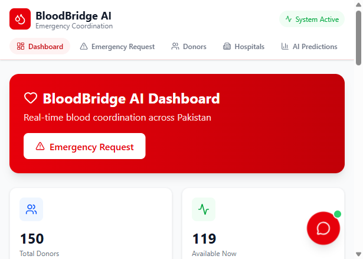
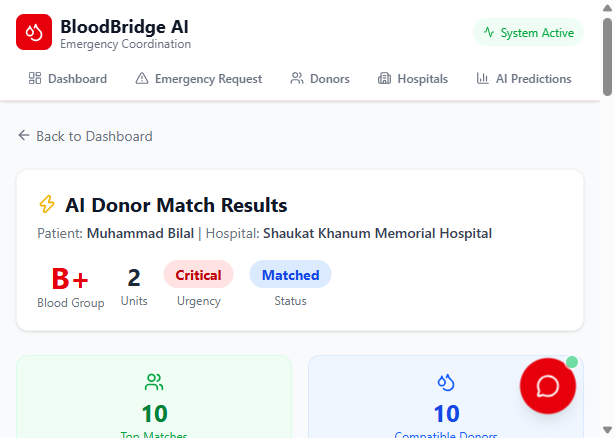
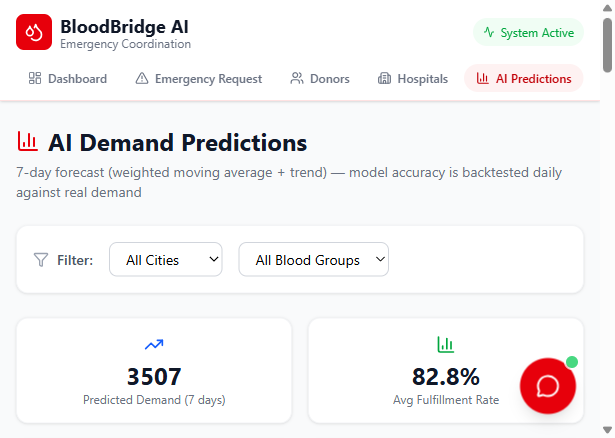
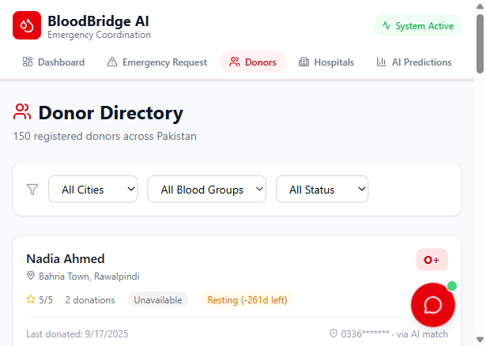

# BloodBridge AI — Emergency Blood Coordination System

BloodBridge AI coordinates emergency blood requests between hospitals, blood banks, and voluntary donors across Pakistan. It combines **safe donor matching**, **data-driven demand forecasting**, and an **assistant chatbot** in a single dashboard.

## Problem

In a blood emergency, families in Pakistan waste critical hours calling relatives, posting on Facebook, and visiting blood banks one by one. Meanwhile:

- Blood banks can't anticipate demand, so rare groups run out without warning.
- Donors are contacted even when they are medically ineligible to donate again.
- Donor phone numbers circulate publicly and get misused.

## What it does

| Feature | How it works |
|---|---|
| **AI Donor Matching** | Ranks compatible donors by blood-type compatibility, distance (haversine), donation recency, and donor rating — and **hard-blocks anyone still inside the mandatory 90-day (men) / 120-day (women) resting window** per Pakistan Blood Transfusion Authority guidelines. |
| **Demand Forecasting** | Weighted 14-day moving average + linear-regression trend + weekday seasonality predicts demand per city and blood group 7 days ahead. The model is **backtested daily against real demand** and its accuracy is displayed on the Analytics page. |
| **Closed Data Loop** | Every request and fulfillment updates demand history, donor availability, and hospital inventory — so predictions learn from real usage, not just seed data. Surplus donated units restock the bank automatically. |
| **Privacy by Default** | Patient names are masked (`A*** K***`) on all public views and contact numbers are never exposed; donor phone numbers are masked (`0335*******`) in the public directory and only revealed through the AI matching process. |
| **Assistant Chatbot** | Instant answers on compatibility, eligibility rules, live inventory, and how to submit a request. |
| **Validation & Persistence** | All API inputs are validated (blood group enums, Pakistani phone format, units 1-20, hospital existence). Data persists to disk, so a server restart never loses it. |

A separate **mobile prototype** (`prototype/index.html`) demonstrates the full trust model: role-based onboarding (staff vs donor), institution verification before posting, private patient references, donor self-screening questionnaires, and replacement-donor registration. It runs standalone in any browser (localStorage-backed).

## Screenshots

| Dashboard | AI Donor Match |
|---|---|
|  |  |

| Analytics (backtested accuracy) | Donor Directory (masked phones) |
|---|---|
|  |  |

> Presentation slides (with these screenshots embedded) are in [`presentation/slides.html`](presentation/slides.html) — open in any browser, navigate with arrow keys, print to PDF. The portal write-up lives in [`presentation/writeup.md`](presentation/writeup.md).

## Tech Stack

- **Frontend:** React 19, Vite, Tailwind CSS, Recharts, React Router, Lucide icons
- **Backend:** Node.js, Express
- **Storage:** In-memory store with JSON-file persistence (Mongoose-ready schemas for a future MongoDB migration)

## Quick Start

```bash
# 1. Install dependencies
npm run install:all        # from the bloodbridge-ai folder

# 2. Run both client and server
npm run dev                # server on :5000, client on :5173
```

Open http://localhost:5173 for the dashboard.

- To reset demo data: stop the server, delete `server/data/bloodbridge-data.json`, restart — a fresh dataset (150 donors, 19 hospitals/blood banks, 90 days of demand history across 6 cities) is seeded automatically.
- To run the API test suite: `cd server && node smoke-test.js` (server must be running).
- Mobile prototype: open `prototype/index.html` directly in a browser.

## API Overview

| Endpoint | Purpose |
|---|---|
| `GET /api/stats` | Dashboard aggregates (masked patient names) |
| `GET /api/donors` | Donor directory — masked phones, eligibility status, filters (city, blood group, availability, eligibility) |
| `POST /api/donors` | Register donor (validated) |
| `GET /api/hospitals` | Hospitals & blood banks with live inventory |
| `POST /api/requests` | Create emergency request (validated; feeds demand history) |
| `PATCH /api/requests/:id/fulfill` | Close the loop: confirm donating donors → resting windows, inventory restock, demand records |
| `POST /api/match/:requestId` | Run AI donor matching (safety-filtered) |
| `GET /api/predictions` | 7-day demand forecast per city & blood group |
| `GET /api/predictions/accuracy` | Backtested model accuracy (predicted vs actual, MAPE-based) |
| `POST /api/chat` | Assistant chatbot |

## Safety & Scope (honest limitations)

This is a working prototype. For production deployment it would additionally need: authenticated accounts with role-based access (the mobile prototype demonstrates this model), real SMS/WhatsApp notifications, blood-unit expiry tracking (whole blood ~35-42 days, platelets ~5 days), hospital inventory integration via HL7/FHIR, and PDPA/HIPAA-style data governance. The statistical forecasting is intentionally transparent (moving average + trend) — accurate and explainable today, upgradeable to ARIMA/LSTM as real data volume grows.
